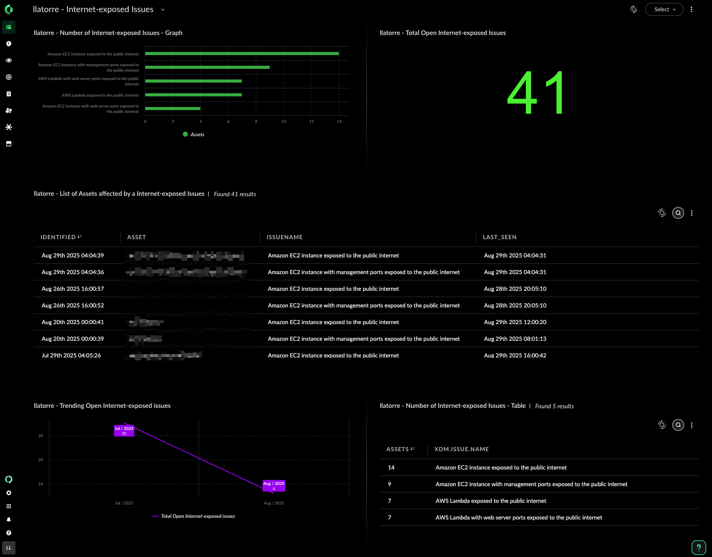

## Internet Exposed Issues Dashboard

- [Repository Files](#repository-files)
- [Description](#description)
- [Requirements](#requirements)
- [Dashboard Screenshot](#dashboard-screenshot)

---

#### Repository Files

 | Files |  Description |
 |----|----|
 | [README.md](README.md) | Dashboard Description |
 | [dashboard.json](dashboard.json) | Dashboard JSON |
 | [dashboard.png](dashboard.png) | Dashboard Screenshot |

---

#### Description

Identify open issues from the Cloud Network Analyzer Detection Method and Internet Exposed Assets

---

#### Requirements

> [!IMPORTANT]
> In order for the dashboard drilldowns to work, it is required to search/replace the dashboard.json for :point_right: `placeholder.com` and replace with your tenant URL.
>
> - Example:
>    - Before: https://placeholder.com/assets/inventory
>    - After: https://mytenant.xdr.us.paloaltonetworks.com/assets/inventory

---

#### Dashboard Screenshot

